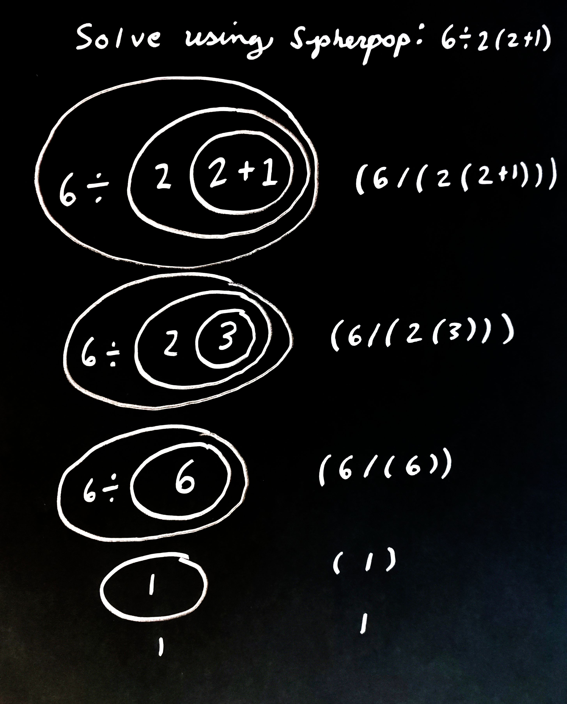
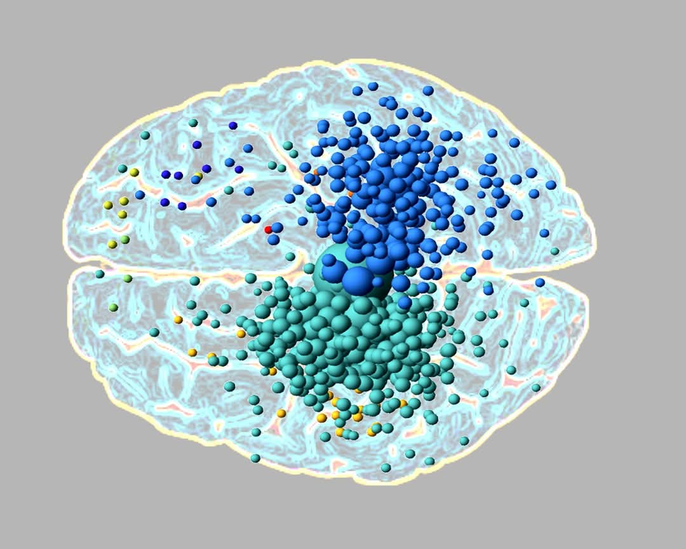
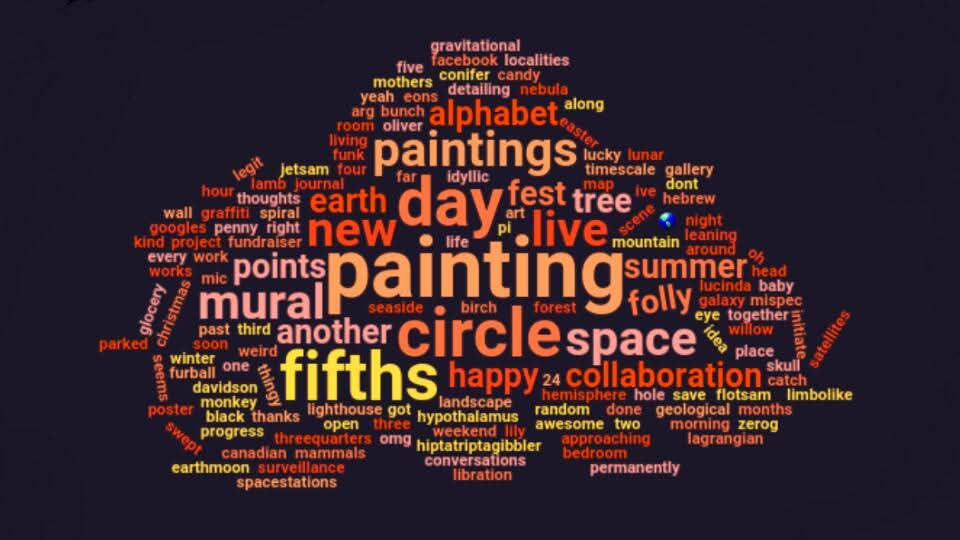
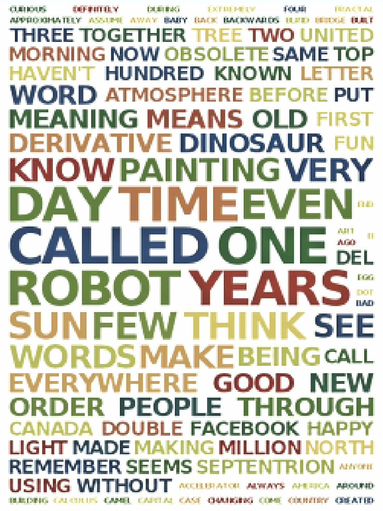
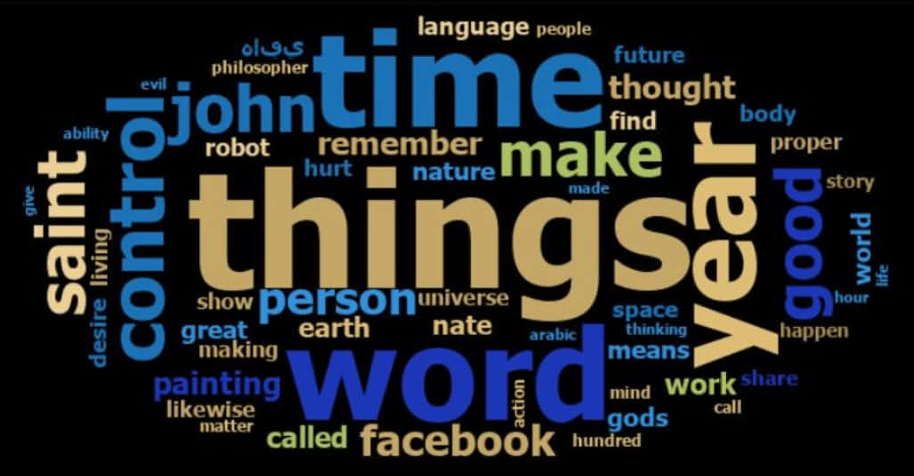
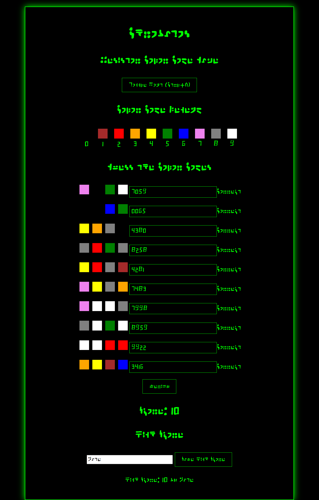
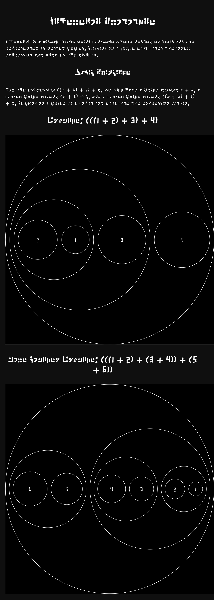
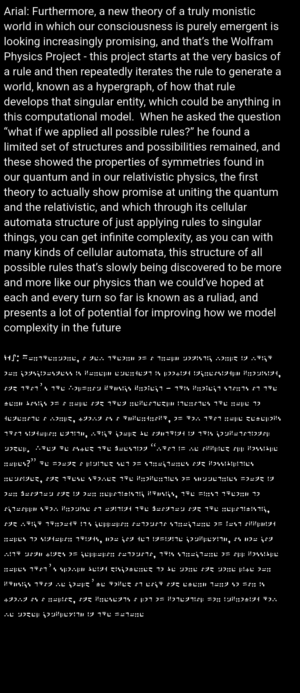
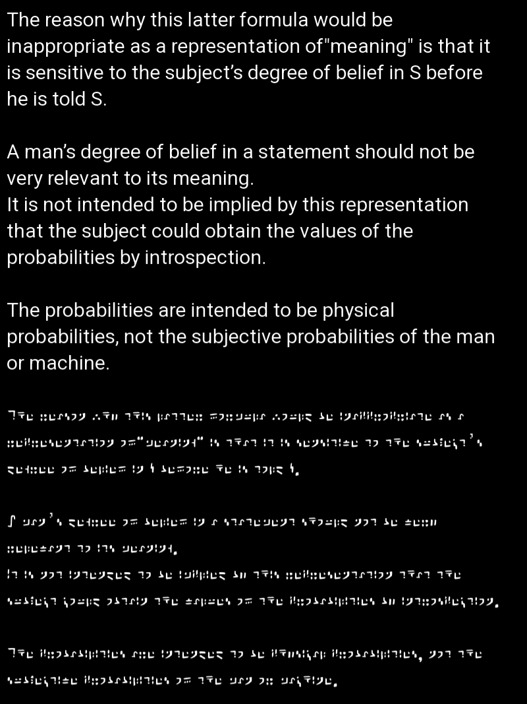

# Standard Galactic

## Spherepop Demo

<!--

-->

<!--

-->
Try the [Galactic Translator](https://standardgalactic.github.io/sga-converter.html)

And [Typing Tutor](https://standardgalactic.github.io/typing-tutor)

Play [Chrobatos](https://standardgalactic.github.io/chrobatos.html)

And [Color Radio](https://standardgalactic.github.io/color-radio.html)

Coming soon:

3d Programming Language
[Spherepop](https://standardgalactic.github.io/spherepop.html)

Cosmic Web Simulator
[Centerfuge](https://standardgalactic.github.io/Centerfuge)

<!--

-->
